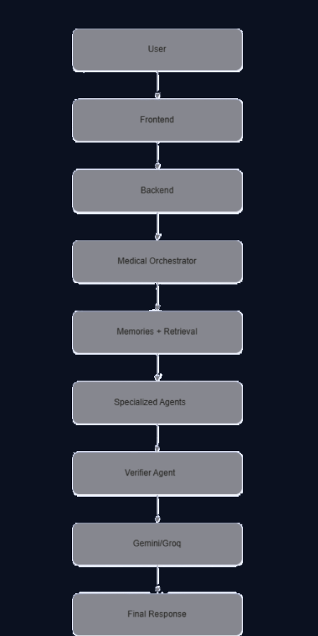
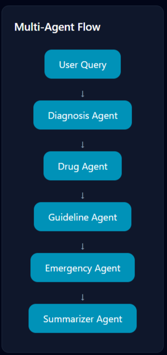
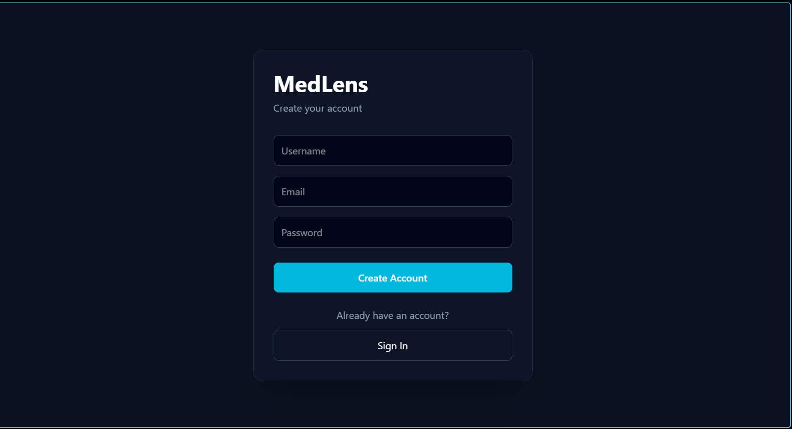
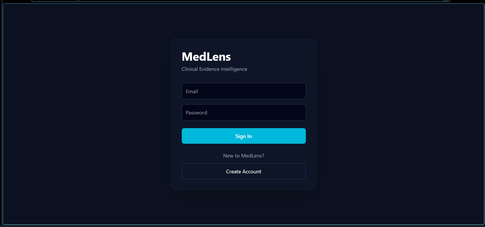
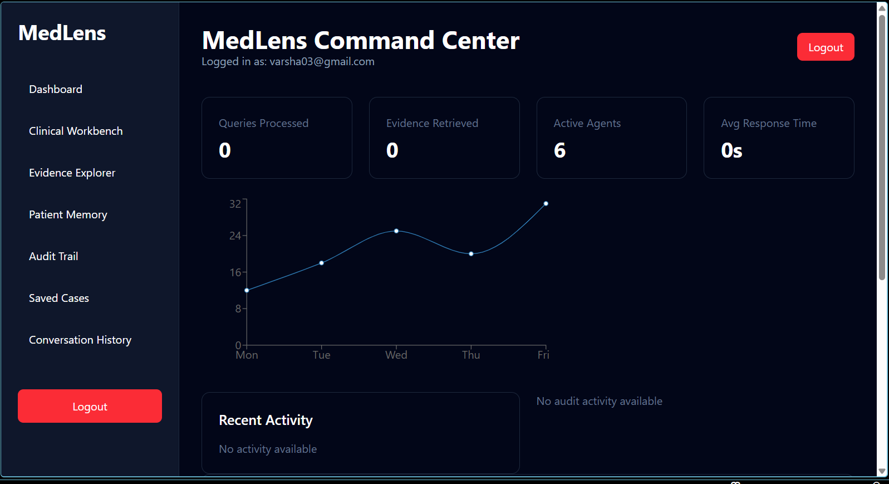
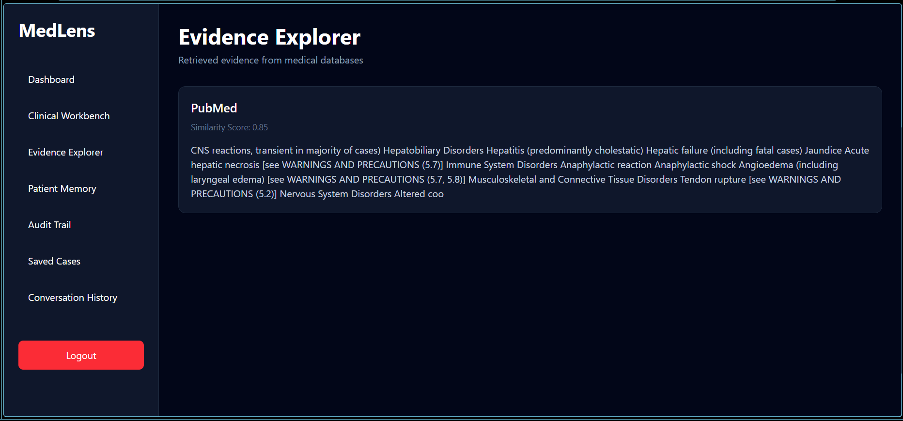

# MedLens – Multi-Agent Clinical AI System

MedLens is an AI-powered clinical decision support system that combines Retrieval-Augmented Generation (RAG), specialized medical agents, patient memory, and evidence-based reasoning to provide safe and explainable clinical responses.

## Features

* Multi-Agent Architecture
* Clinical Diagnosis Agent
* Drug Information Agent
* Treatment Agent
* Guideline Agent
* Emergency Detection Agent
* Summarizer Agent
* Verifier Agent
* ChromaDB-powered Retrieval
* Patient Memory
* Conversation Memory
* Safety Layer
* Evidence Tracking
* Audit Logs
* Dashboard Metrics
* Modern React UI

## 🏗Architecture

User Query
    ↓
Medical Orchestrator
    ↓
Agent Routing
    ↓
Specialized Agent
    ↓
Retriever (ChromaDB)
    ↓
LLM
    ↓
Verifier Agent
    ↓
Safety Checker
    ↓
Final Clinical Response

## Workflow

## Agents

### Diagnosis Agent

Analyzes symptoms and provides possible conditions.

### Drug Agent

Provides:

* Drug information
* Dosage
* Side effects
* Drug interactions

### Treatment Agent

Provides treatment recommendations.

### Guideline Agent

Retrieves WHO and NIH recommendations.

### Emergency Agent

Identifies life-threatening situations and recommends escalation.

### Summarizer Agent

Generates concise clinical summaries.

### Verifier Agent

Checks responses for consistency and reduces hallucinations.

## System Architecture

## Tech Stack

### Backend

* Python
* FastAPI
* ChromaDB
* Sentence Transformers
* Groq API
* Multi-Agent Architecture

### Frontend

* React
* Vite
* Tailwind CSS
* Axios

### Database

* ChromaDB

##  Project Structure

ai_engine/
│
├── agents/
├── memory/
├── models/
├── prompts/
├── tools/
├── orchestrator/
└── evaluation/

backend/
│
├── routes/
├── services/
└── models/

frontend/
│
├── components/
├── pages/
├── layouts/
└── services/

## Retrieval-Augmented Generation

MedLens uses:

1. Query embedding
2. ChromaDB retrieval
3. Context injection
4. Specialized agent prompting
5. Verifier agent validation

##  Metrics

Tracks:

* Number of Queries
* Evidence Retrieval Count
* Agent Usage
* Average Response Time

Current average response time:

≈ 11 seconds

## Safety Features

* Emergency symptom detection
* Hallucination reduction
* Evidence-based responses
* Medical disclaimer layer

##  Installation

### Clone Repository

git clone https://github.com/Vaish1005/MEDLENS.git

### Backend

cd backend

pip install -r requirements.txt

uvicorn app:app --reload

### Frontend

cd frontend

npm install

npm run dev

## User Interface

### Register & Login Page

### Dashboard

### Clinical Workbench

### Evidence Panel

## Environment Variables

Create a `.env` file:

GROQ_API_KEY=YOUR_API_KEY

## Sample Queries

See [Sample Queries](docs/sample_queries.md)

## Future Improvements

* JWT Authentication
* PostgreSQL
* Redis Memory
* LangGraph Workflows
* RAG Evaluation
* PDF Reports
* Docker Deployment
* Kubernetes
* Cloud Deployment

## Disclaimer

MedLens is an AI-powered clinical decision support system intended for educational and research purposes only.

It does not replace licensed medical professionals and should not be used as a substitute for medical advice, diagnosis, or treatment.

